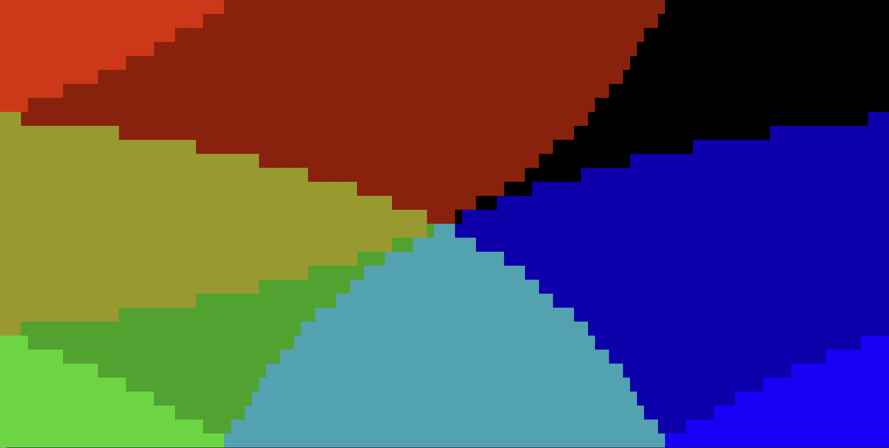
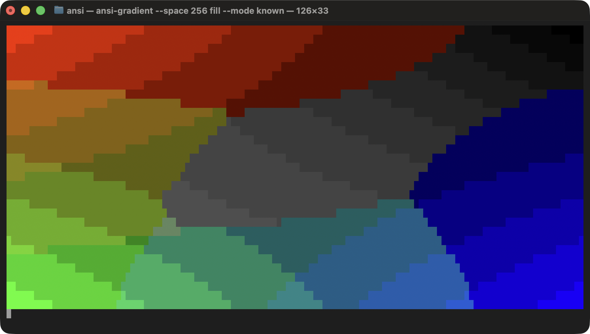
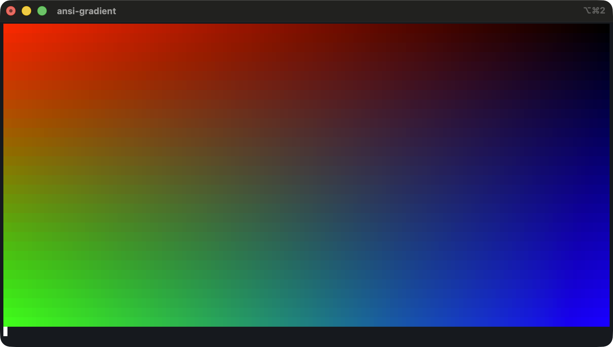
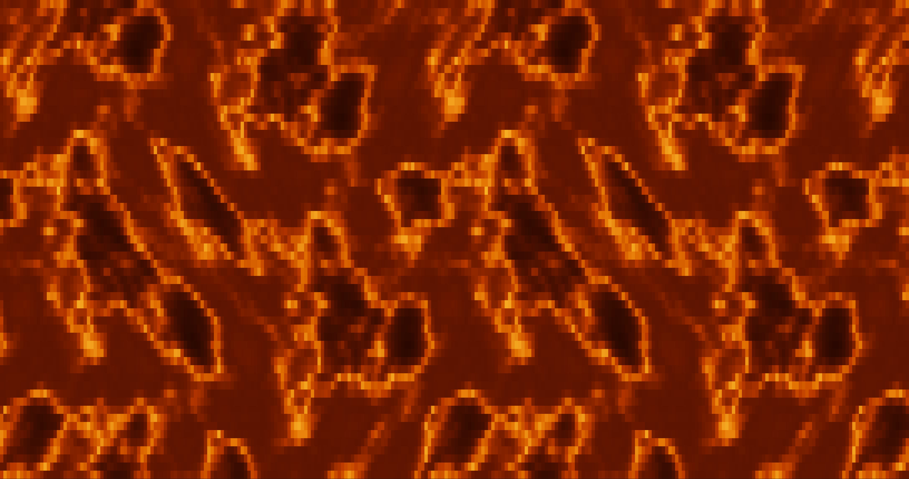
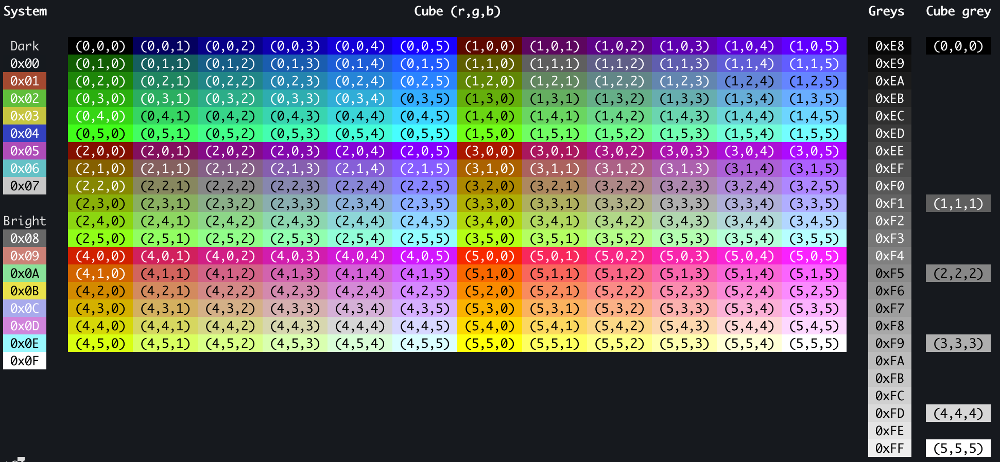

# csi

A cross-platform C++ tool for exercising terminal CSI sequences.

## Build

```sh
./make.sh     # macOS and Linux
make.bat      # Windows
```

Both wrap CMake and pick the platform backend at link time. The binary lands in
`build/csi`.

## Commands

### `fill`

A bilinear gradient across the screen. Runs until Ctrl-C.

```sh
csi fill --space 16
```



```sh
csi fill --space 256
```



```sh
csi fill --space RGB
```



### `lava`

Quake's turbulent surface effect at 30 fps: a lava texture sampled through a sine
warp that displaces each axis by the turbulence read at the other, so the surface
rolls rather than slides. Runs until Ctrl-C, or `--seconds <n>`.

```sh
csi lava
```



### `256`

The whole 256-color palette on one screen. Four sections: the system colors split
into `Dark` and `Bright`, the color cube, the grey ramp, and the cube's own greys.
System and ramp cells are labelled with their index, cube cells with their `(r,g,b)`
coordinates. Needs a window of at least 137x28.

```sh
csi 256
```



## Options

```
Usage: csi <command> [options]

Commands:
  fill       Render the gradient
  lava       Animate Quake lava at 30 fps
  256        Chart the 256-color palette with each index

fill options:
  --color  <name|#RRGGBB>     Upper-right corner color
  --fill   <c|bg>             Fill glyph or background
  --mode   <all|known|cube>   Palette subset (--space 256 only)

lava options:
  --fill   <c|bg>             Fill glyph or background
  --seconds <n>               Stop after n seconds (default: Ctrl-C)

Global options:
  --space  <16|256|RGB>       Terminal color space
  -h, --help                  Show this help
  -v, --version               Show version
```

`--mode` picks which slice of the palette a nearest match may draw from. `all` uses
every entry; `known` skips the sixteen system colors, whose values are whatever the
terminal theme paints them; `cube` uses only the 6x6x6 color cube, with no grey ramp.

The `256` chart addresses palette slots directly rather than going through the RGB
mapping, so `--space` and `--mode` do not affect it.
